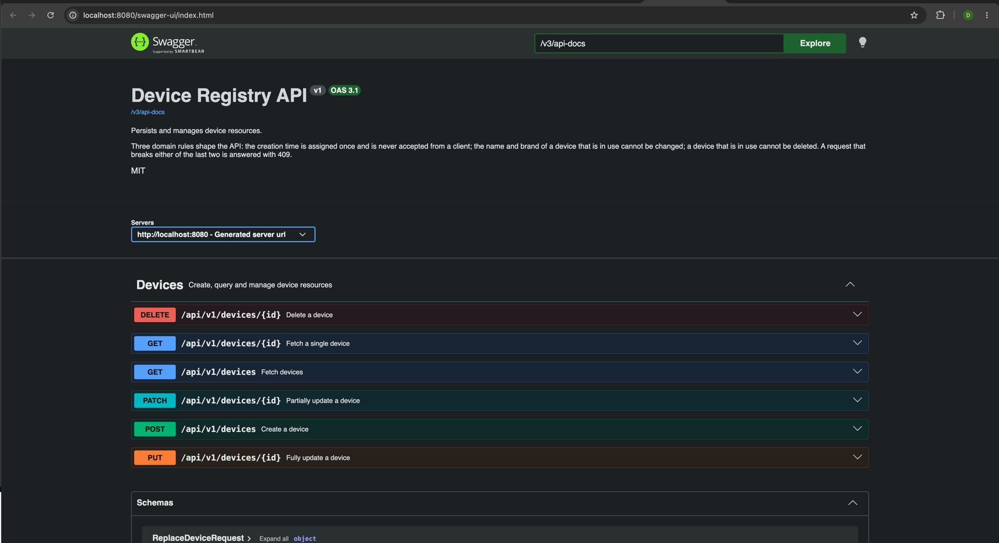
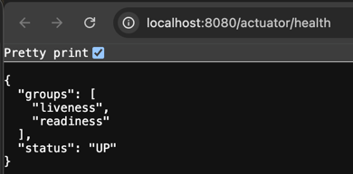
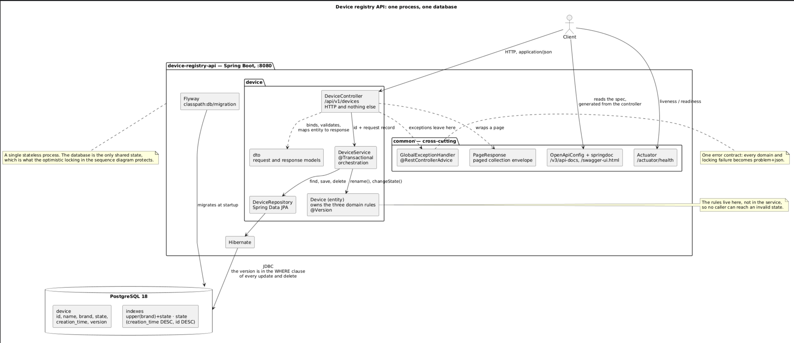
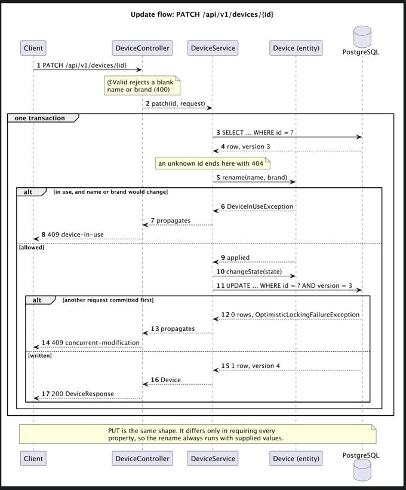
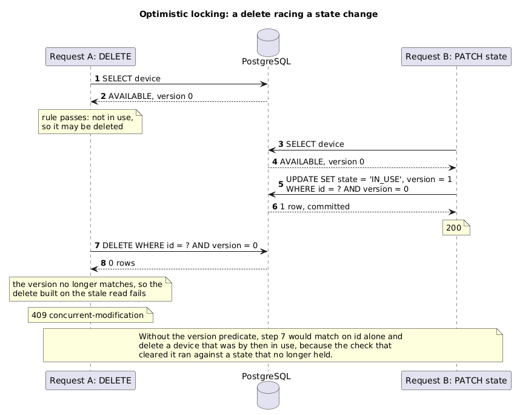

# Device Registry API

A REST API for persisting and managing device resources.

## Tech stack

| Concern | Choice |
|---|---|
| Language | Java 21 |
| Framework | Spring Boot 4.1.1 (Spring MVC) |
| Persistence | PostgreSQL 18 + Spring Data JPA |
| Schema migrations | Flyway |
| Build | Gradle (wrapper included) |
| Documentation | springdoc-openapi / Swagger UI |
| Tests | JUnit 5, Mockito, Testcontainers |

## Running it

Docker is the only prerequisite — the Gradle wrapper downloads its own JDK.

### Everything in containers

```bash
docker compose -f compose.app.yaml up --build
```

Builds the application image and starts it with PostgreSQL. The app waits for the database
healthcheck before starting.

### Local development

```bash
./gradlew bootRun
```

`spring-boot-docker-compose` starts the PostgreSQL container from `compose.yaml` and wires the
datasource. The container stops with the application.

Either way the API is on <http://localhost:8080>.

## API documentation

With the application running:

- **Swagger UI** — <http://localhost:8080/swagger-ui.html>
- **OpenAPI document** — <http://localhost:8080/v3/api-docs>
- **Health** — <http://localhost:8080/actuator/health> (`/readiness` backs the container
  healthcheck; no other actuator endpoint is exposed)

The specification is generated from the controller, so it cannot drift from the implementation.



The health endpoint reports the two probes the container healthcheck depends on:



## Endpoints

| Method | Path | Purpose | Success | Errors |
|---|---|---|---|---|
| `POST` | `/api/v1/devices` | Create a device | `201` + `Location` | `400` |
| `GET` | `/api/v1/devices` | Fetch devices, optionally filtered | `200` | `400` |
| `GET` | `/api/v1/devices/{id}` | Fetch a single device | `200` | `400`, `404` |
| `PUT` | `/api/v1/devices/{id}` | Fully update a device | `200` | `400`, `404`, `409` |
| `PATCH` | `/api/v1/devices/{id}` | Partially update a device | `200` | `400`, `404`, `409` |
| `DELETE` | `/api/v1/devices/{id}` | Delete a device | `204` | `400`, `404`, `409` |

Six operations cover the seven required functionalities: fetching by brand and fetching by
state are filters on the collection rather than endpoints of their own.

Collection query parameters: `brand` (case-insensitive, trimmed; blank means unfiltered),
`state`, `page`, `size`, `sort`.
Results default to 20 per page, newest first, and `size` is capped at 100. The primary key is
always appended to the sort, so paging stays stable when rows tie on the sort key.

### Examples

```bash
# Create. State is optional and defaults to AVAILABLE.
curl -i -X POST http://localhost:8080/api/v1/devices \
  -H 'Content-Type: application/json' \
  -d '{"name":"Pixel 9","brand":"Google"}'

# Fetch all, by brand, by state
curl http://localhost:8080/api/v1/devices
curl 'http://localhost:8080/api/v1/devices?brand=google'
curl 'http://localhost:8080/api/v1/devices?state=IN_USE'
curl 'http://localhost:8080/api/v1/devices?state=AVAILABLE&page=0&size=5'

# Fetch one
curl http://localhost:8080/api/v1/devices/{id}

# Full update: every mutable property is required
curl -X PUT http://localhost:8080/api/v1/devices/{id} \
  -H 'Content-Type: application/json' \
  -d '{"name":"Pixel 10","brand":"Google","state":"IN_USE"}'

# Partial update: omitted properties are left alone
curl -X PATCH http://localhost:8080/api/v1/devices/{id} \
  -H 'Content-Type: application/json' \
  -d '{"state":"INACTIVE"}'

# Delete
curl -X DELETE http://localhost:8080/api/v1/devices/{id}
```

A device looks like this:

```json
{
  "id": "4f1917f8-e01c-4e85-bc79-451404fb9b1b",
  "name": "Pixel 9",
  "brand": "Google",
  "state": "AVAILABLE",
  "creationTime": "2026-10-07T04:27:53.954478Z"
}
```

`state` is one of `AVAILABLE`, `IN_USE`, `INACTIVE`.

## Architecture

One stateless process in front of one database. The controller does HTTP, the service owns the
transaction, and the entity owns the rules — so the interesting decisions all sit in the
`device` package and `common` only holds what cuts across it.



Two things the picture is making a point of. The domain rules sit on the entity rather than in
`DeviceService`, so no caller can route around them. And the database is the only shared state —
nothing is cached and nothing is held between requests — which is why a read and a write that
belong to the same request need the version column to stay consistent.

## Domain rules

1. **The creation time cannot be updated.** It is stamped when the device is created. No
   request model carries the field, the column is mapped as non-updatable, and the entity has
   no setter for it, so a client that sends one is simply ignored.
2. **The name and brand cannot be updated while a device is in use.** Attempting it returns
   `409`.
3. **A device in use cannot be deleted.** Attempting it returns `409`.

Rules 1 and 2 live on the `Device` entity rather than in the service layer, so no caller can
reach an invalid state. Rule 3 guards a delete, which is not a transition on the entity, so it
sits in `DeviceService`. Each is a check against the state the device was read with, so they
need optimistic locking to hold when two requests overlap — see below.

### Request flow

How an update is served, and where each rule is enforced. `PUT` is the same shape; it
differs only in requiring every property.



## Errors

Every error is an [RFC 7807](https://www.rfc-editor.org/rfc/rfc7807) `application/problem+json`
document produced by one `@RestControllerAdvice`:

```json
{
  "type": "https://api.device-registry/problems/device-in-use",
  "title": "Device is in use",
  "status": 409,
  "detail": "Cannot change the name or brand of device e7d21752-… while it is in use",
  "instance": "/api/v1/devices/e7d21752-…"
}
```

Validation failures add a per-field breakdown:

```json
{
  "title": "Validation failed",
  "status": 400,
  "errors": [
    { "field": "brand", "message": "must not be blank" },
    { "field": "name", "message": "must not be blank" }
  ]
}
```

## Tests

```bash
./gradlew test
```

85 tests, grouped by what they isolate:

| Level | What it covers |
|---|---|
| `DeviceTest` | the domain rules, directly on the entity |
| `DeviceServiceTest` | orchestration, with a mocked repository |
| `DeviceControllerTest` | `@WebMvcTest` slice — status codes, validation, JSON shape |
| `DeviceRepositoryTest` | queries against real PostgreSQL |
| `DeviceConcurrencyTest` | interleaved transactions, against real PostgreSQL |
| `DeviceApiIntegrationTest` | every endpoint end to end against real PostgreSQL |
| `OpenApiDocumentationTest` | the published specification stays complete |

Integration tests use Testcontainers, so Docker must be running. Colima is detected
automatically by the build; for a runtime on another non-default socket, set `DOCKER_HOST`
and `TESTCONTAINERS_DOCKER_SOCKET_OVERRIDE` before running the tests.

## Design decisions

**Filters are query parameters, not sub-paths.** `GET /devices?brand=Google` rather than
`GET /devices/brand/Google`. Narrowing a collection does not introduce a new resource.

**The entity is never serialised.** Separate request and response records keep the persistence
model out of the HTTP contract and make it impossible for a client to supply `id` or
`creationTime`.

**A full update may release a device that is in use.** `PUT` requires every property, so a
caller that only wants to change the state must resend the existing name and brand. Sending
*identical* values is not an update, so it is allowed; sending a *different* name or brand
while the device is in use is rejected, even if the same request would also move the device out
of use. The rule is evaluated against the stored state, not the requested one, which keeps
`PUT` and `PATCH` consistent.

**The name and brand are trimmed on write.** The brand filter strips its argument, so a
brand persisted with surrounding whitespace would be unreachable through it from either side:
a trimmed query would not match the padded column, and a padded query is itself stripped
before use. Normalising in `Device` rather than in the request records keeps the stored form
and the filtered form in agreement for every caller, and makes the length limit count visible
characters.

**`null` and absent are the same thing in a `PATCH`.** No property of a device is nullable, so
there is nothing a client could mean by explicitly setting one to `null`. This avoids needing a
tri-state wrapper.

**Responses use an explicit page envelope.** Spring's `Page` is not serialised directly because
its JSON form is not part of its public contract.

**UUID keys.** Identifiers appear in URLs; sequential integers would leak the size of the
inventory and let clients enumerate it.

**Flyway owns the schema.** Hibernate runs with `ddl-auto: validate`, so a mapping that drifts
from the migrations fails at startup rather than silently altering a table. The schema is a
single migration because nothing has been deployed yet; once it has, a migration that has run
is never edited — its checksum would no longer match — and a correction arrives as a new file.

**Writes are guarded by optimistic locking.** Every rule here is read-check-write: load the
device, test the rule against the state it was loaded with, then write. Another request can
commit in between, and under PostgreSQL's default `READ COMMITTED` the write would still
succeed — so a device that had since gone into use could be deleted, because the check that
cleared it ran against a state that no longer held. A `@Version` column makes Hibernate match
the version in the `WHERE` clause of every update and delete, so a write built on a stale read
affects no rows and fails instead. The service does not retry; the request gets `409` and the
client re-reads. `DeviceConcurrencyTest` interleaves two transactions at exactly that point.

The interleaving, with a delete racing a state change:



Without the version predicate, step 7 would match on `id` alone and delete a device that was
by then in use, because the check that cleared it ran against a state that no longer held.

The version is not exposed in the API. It protects a read and a write that belong to the *same*
request, which is where the domain rules are enforced. Guarding against a *client* overwriting
a change it never saw is a different problem, and the REST answer to it is an `ETag` with
`If-Match` — see below.

**Sorting is totalled on the primary key.** `creation_time` alone is not a unique ordering, and
rows that tie on it have no defined position — a concurrent write can then move one across a
page boundary, so it appears twice and another is never returned. Appending `id` makes the
order total. The index on `(creation_time DESC, id DESC)` matches the default sort.

**Domain exceptions live in the `device` package.** They describe device rules, so the domain
package does not depend on the cross-cutting one; `GlobalExceptionHandler` depends inward on
them, which is the direction that should hold.

### Not included

Deliberately out of scope for this exercise, and worth adding before production:

- **Authentication and authorisation**, and **rate limiting**.
- **`ETag` / `If-Match` on a device.** Optimistic locking stops a stale write *inside* the
  service, but a client that fetched a device, sat on it, and then sent a `PUT` will still
  overwrite whatever changed in the meantime: its request carries no indication of which
  version it was built on. Returning the version as an `ETag` and requiring `If-Match` on an
  update would extend the same guarantee to the client, and the `409` plumbing already exists.
- **Retry on a concurrent modification.** A `409` asks the client to re-read and retry. For a
  state change that does not depend on the previous value, retrying once on the server would be
  reasonable, but it needs care to stay idempotent.

## Configuration

No datasource configuration is committed. To point at an external database:

```bash
export SPRING_DATASOURCE_URL=jdbc:postgresql://host:5432/devices
export SPRING_DATASOURCE_USERNAME=...
export SPRING_DATASOURCE_PASSWORD=...
```

The credentials in the compose files are for local development only.

## Layout

```
src/main/java/org/device/deviceregistryapi/
├── common/                     cross-cutting concerns
│   ├── GlobalExceptionHandler  the single error contract
│   ├── PageResponse            paged collection envelope
│   └── OpenApiConfig
└── device/
    ├── Device                  entity; owns the domain rules
    ├── DeviceState             AVAILABLE | IN_USE | INACTIVE
    ├── DeviceRepository
    ├── DeviceService           transactions and orchestration
    ├── DeviceController        HTTP only
    ├── DeviceInUseException    → 409
    ├── DeviceNotFoundException → 404
    ├── InvalidDeviceException  → 400
    └── dto/                    request and response models

src/main/resources/db/migration/   Flyway migration
```
